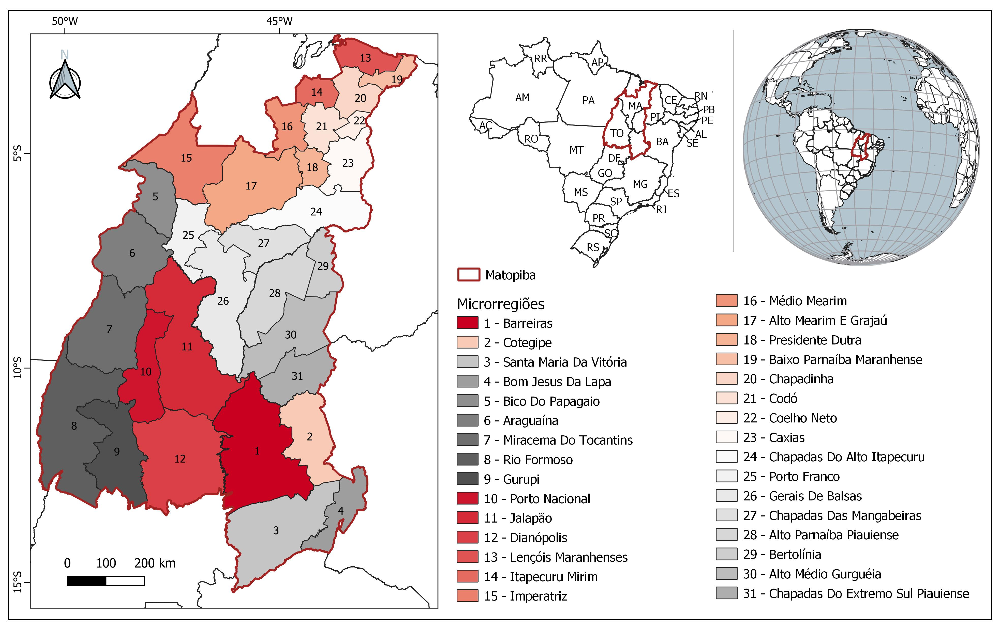

<style type="text/css">

body{ /* Normal  */
      font-size: 12px;
  }
td {  /* Table  */
  font-size: 12px;
}
h1.title {
  font-size: 32px;
  color: DarkRed;
}
h1 { /* Header 1 */
  font-size: 24px;
  color: DarkRed;
}
h2 { /* Header 2 */
    font-size: 22px;
  color: DarkRed;
}
h3 { /* Header 3 */
  font-size: 18px;
  color: DarkRed;
}
code.r{ /* Code block */
    font-size: 12px;
}
pre { /* Code block - determines code spacing between lines */
    font-size: 14px;
}
</style>

A ocorrência de queimadas e incêndios florestais causam impactos ambientais, sociais e econômicos. Saber onde as queimadas ocorrem  é útil para criar planos de ação de prevenção de controle, principalmente em regiões onde ela é frequente. 

Nos últimos anos, a ocorrência de queimadas tem sido frequente na região do Matopiba, sendo o local de maior área queimada no bioma Cerrado.

Nesse contexto, o objetivo é apresentar uma análise da ocorrência de focos de queimadas, no período de  2011 a 2021, nas microrregiões do Matopiba e identificar:

1. Em quais microrregiões ocorreram o maior número de focos de queimadas;
2. Em quais microrregiões ocorreram maior número de focos de queimadas por km²;
3. Quais meses do ano há maior ocorrência de focos de queimadas.

# Região do Matopiba 

O Matopiba é uma região formada pelo Estado do Tocantins e parte dos Estados do Maranhão, Piauí e Bahia. A região é considerada uma fronteira agrícola e seu nome é um acrônimo formado com as iniciais dos nomes dos estados que a compõe.

O Matopiba é uma região delimitada através de um estudo da Embrapa [@matopibaproposta], onde é disponibilizada  uma lista de municípios e microrregiões. Essa delimitação em microrregiões e municípios permitir subrecortes territoriais de forma a ser operacional para seu uso. A delimitação teve por base principalmente as áreas de Cerrado e a dimensão socioeconômica, principalmente as relacionadas a agropecuária. A definição da área do Matopiba corresponde aos limites de 31 microrregiões (Figura \@ref(fig:matopiba)) e de 337 municípios.


```{r matopiba, echo=FALSE, fig.align='center', fig.alt="Mapa", fig.cap="Mapa de localização do Matopiba e das microrregiões. Fonte dos dados limites estaduais e das microrregiões: @ibgedados.", message=FALSE, warning=FALSE, out.width="90%"}



```

De modo a manter a delimitação atualizada da área da região do Matopiba, foi utilizada a base atualizada (ano 2020) de feições das microrregiões do @ibgedados. 

# Ocorrência de focos de queimada nas microrregiões do Matopiba

Foram utilizados dados de focos de queimadas que são indicativos para fogo ativo. Os dados foram obtidos na plataforma do [Programa Queimadas/INPE](https://queimadas.dgi.inpe.br/) para o período de 2011 a 2021. Foram considerados somente os focos obtidos do satelite de referência, indicado para análises temporais.

```{r focos, include=FALSE}
focos <-
  readr::read_csv(here::here("dados", "csv", "focos_ano_matopiba.csv"))

#criar uma coluna só com o ano
focos$ano_mes <- lubridate::ym(focos$ano_mes)
focos$ano <- lubridate::year(focos$ano_mes)

# Dataframe com a contagem de foco por mês e por microrregião
focosano <- focos |>
  dplyr::group_by(ano, nm_micr) |>
  dplyr::summarise(totalano = sum(n))

```


```{r focos2 ano, echo=FALSE}
#tranformando linhas dos anos em colunas
focosporano <- focosano |>
  tidyr::pivot_wider(names_from = ano,
                     values_from = totalano)

#calculando total de focos
focosporano$Total <- rowSums(focosporano[, 2:12])

# Ordenando os focos totais
focost <- focosporano$Total
focost <- sort(focost, decreasing = TRUE)

#formatação para inserir o separador de milhar
format <-
  scales::dollar_format(
    prefix = "",
    suffix = "",
    largest_with_cents = 0,
    big.mark = ".",
    negative_parens = FALSE
  )

```


A tabela abaixo mostra o número de ocorrência de focos de queimadas nas microrregiões do Matopiba. As microrregiões Alto Mearim e Grajaú (MA), Jalapão (TO) e Rio Formoso (TO) apresentação maior número de ocorrência de focos de queimadas no período de 2011 a 2021, com `r format(focost[1])`, `r format(focost[2])` e `r format(focost[3])` focos, respectivamente.

```{r tabela, tab.cap="Número de ocorrência de focos de queimadas por microrregião do Matopiba.", echo=FALSE}
# renomeando nome da coluna
# atualizando nome das colunas
focosporano = focosporano |>
  dplyr::rename(Microrregião = nm_micr)

# tabela e formatação com separador de milhar
DT::datatable(focosporano, options = list(scrollX = TRUE)) |>
  DT::formatCurrency(
    c(
      "2011",
      "2012",
      "2013",
      "2014",
      "2015",
      "2016",
      "2017",
      "2018",
      "2019",
      "2020",
      "2021" ,
      "Total"
    ),
    currency = "",
    interval = 3,
    mark = ".",
    digits = 0
  )

```

```{r shape, include=FALSE}
#leitura do shapefile com as microrregiões
m <-
  sf::st_read(here::here("dados", "shp", "microrregioes_matopiba.shp"))

#atualizando nome das colunas
focosano = focosano |>
  dplyr::rename(nm_micro = nm_micr)

#juntando a tabela com o shapefile através do atributo "nm_micro"
shp_micro <- dplyr::left_join(m, focosano, by = "nm_micro")

#cria atributo "area" e cálcula de área das microrregiões
shp_micro$area <- sf::st_area(shp_micro$geometry) / 1000000

#criar atributo "D" e calcula a densidade de focos por km²
shp_micro <- shp_micro |>
  dplyr::mutate(D = as.numeric(totalano / area))
shp_micro$ano <- as.character(shp_micro$ano)  
```


```{r formato, include=FALSE}
# ordenar as linhas em função da densidade
d <- shp_micro |>
  dplyr::select(nm_micro, ano, D) |>
  dplyr::arrange(desc(D))
d[1]$nm_micro[1]

#formatação do separador de milhar e decimal
format2 <-
  scales::dollar_format(
    prefix = "",
    suffix = "",
    largest_with_cents = 2,
    big.mark = ".",
    negative_parens = FALSE,
    decimal.mark = ","
  )
```

Na Figura \@ref(fig:mapas) é apresentado os mapas de ocorrência de focos de queimadas por microrregião expressa pelo número de focos por km². As micrroregiões com mais focos de queimadas por km² foram as microrregiões `r d[1]$nm_micro[1]` com `r format2(d[3]$D[1])` focos/km² em `r d[2]$ano[1]`,  `r d[1]$nm_micro[2]` com `r format2(d[3]$D[2])` focos/km² em `r d[2]$ano[2]` e `r d[1]$nm_micro[3]` com `r format2(d[3]$D[3])` focos/km² em `r d[2]$ano[3]`.

```{r mapas, echo=FALSE, fig.cap="Mapa anual de ocorrência de focos queimadas por km² nas microrregiões do Matopiba.", fig.height=12, message=FALSE, warning=FALSE, out.width="100%"}

#plotagem dos mapas
library(ggplot2)
library(ggspatial)
ggplot(data = shp_micro) +
  geom_sf(aes(fill = D)) +
  theme(text = element_text(size = 10)) +
  scale_fill_gradient(
    low = "#fff7ec",
    high = "#7f0000",
    limits = c(0, 0.2),
    name = "Focos/km²"
  ) +
  annotation_scale() +
  annotation_north_arrow(
    location = 'tl',
    height = unit(0.5, "cm"),
    width = unit(0.5, "cm"),
    style = north_arrow_orienteering(text_size = 5)
  ) +
  facet_wrap( ~ ano,
              nrow = 4,
              ncol = 3)
```

```{r area, include=FALSE}
# Dataframe com a contagem de foco por mês e por microrregião
focosmes <- focos |>
  dplyr::group_by(ano_mes, nm_micr) |>
  dplyr::summarise(totalmes = sum(n))

# atualizando nome das colunas
focosmes = focosmes |>
  dplyr::rename(nm_micro = nm_micr)

d_micro <- dplyr::left_join(m, focosmes, by = "nm_micro")

# cria atributo "area" e calcula de área das microrregiões
d_micro$area <- sf::st_area(d_micro$geometry) / 1000000

# criar atributo "D" e calcula a densidade de focos por km²
d_micro <- d_micro |>
  dplyr::mutate(Dmes = as.numeric(totalmes / area))

```

Na Figura \@ref(fig:grafico1) é apresentado os gráficos para cada microrregião com a ocorrência número de focos de queimadas por km², com dados mensais do período analisado (2011 a 2021). É possivel observar que há uma sazonalidade dessa ocorrência, que é apresentada na Figura \@ref(fig:grafico2) através de gráficos polares para cada microrregião. Os meses de maior ocorrência são agosto, setembro e outubro.

```{r grafico1, fig.height = 15, echo=FALSE, fig.cap="Gráfico de número de focos de queimadas mensais por km², no período de 2011 a 2021, por microrregião.", message=FALSE, warning=FALSE, fig.align='center', out.width="100%"}

#gráfico
ggplot(data = d_micro) +
  geom_line(aes(x = ano_mes, y = Dmes),
            colour = "red") +
  xlab("") + ylab("Focos/km²") +
  theme(text = element_text(size = 9)) +
  facet_wrap( ~ nm_micro,
              nrow = 11,
              ncol = 3)
  
```

```{r datas, include=FALSE}
#criando coluna de ano e de mês
fd <- d_micro
fd$ano <- lubridate::year(d_micro$ano_mes)
fd$mes <- lubridate::month(d_micro$ano_mes)
```

```{r grafico2, fig.height = 25, fig.width= 10,echo=FALSE, fig.cap="Gráfico polar de número de focos de queimadas por km² mensais por microrregião no período de 2011 a 2021.", message=FALSE, warning=FALSE, , fig.align='center', out.width="100%"}

#gráfico polar
fd$Ano <- as.character(fd$ano)
ggplot(fd, aes(x = mes, y = Dmes, color = Ano)) +
  geom_line() +
  scale_color_manual(
    values = c(
      "#ff9d00",
      "#ff7c00",
      "#ff5b00",
      "#ff3a00",
      "#ff1900",
      "#f70000",
      "#d60000",
      "#b50000",
      "#940000",
      "#740000",
      "#530000"
    )
  ) +
  scale_y_continuous(limits =  c(0, 0.096)) +
  scale_x_continuous(breaks = c(2:12)) +
  theme(text = element_text(size = 9),
        legend.position = "top") +
  xlab("Mês") + ylab("Focos/km²") +
  coord_polar() + facet_wrap( ~ nm_micro,
                              nrow = 11,
                              ncol = 3)
```
O relatório foi feito utilizando o software R [@R] com os seguintes pacotes: dplyr [@R-dplyr], DT [@R-DT], geobr [@R-geobr], ggplot2 [@R-ggplot2], ggspatial [@R-ggspatial], knitr [@R-knitr], lubridate [@R-lubridate], purrr [@R-purrr], readr [@R-readr], scales [@R-scales], sf [@R-sf], tidyr [@R-tidyr]. Foi utilizado o template de tema *tactile* do pacote prettydoc [@R-prettydoc].

# Referências
